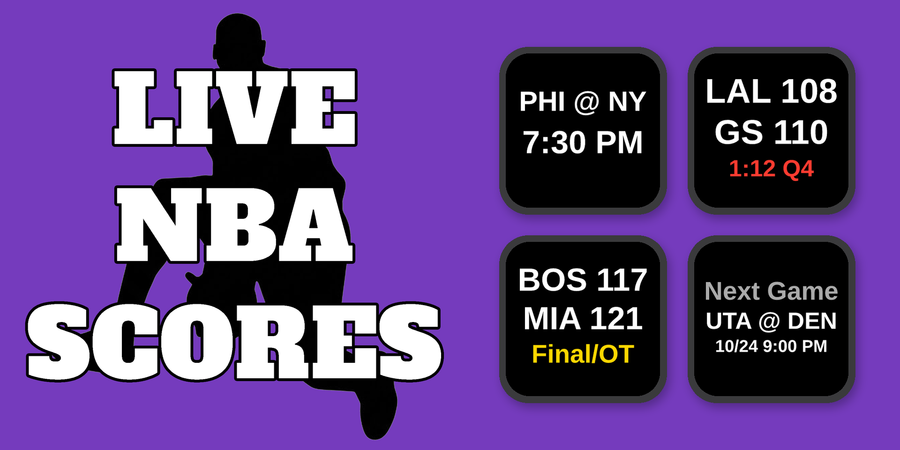
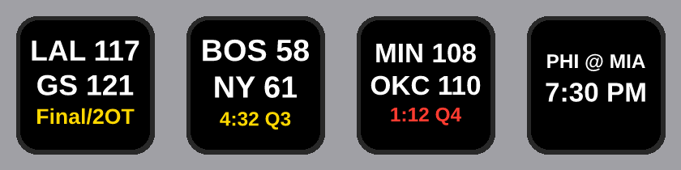

# Live NBA Scores — Stream Deck Plugin



A Stream Deck plugin that shows live basketball scores directly on your keys — **NBA, WNBA, and NBA G League**. Each key tracks one team and updates automatically every 30 seconds.

  [](https://marketplace.elgato.com/product/live-nba-scores-8f051659-5306-4f5f-b1ff-c91aa8ecc0ea)

---

## Features

- **Three leagues** — NBA, WNBA, and G League, 76 teams total
- **Search by name or city** — type a team or location in the settings panel for instant results across all three leagues; searching an NBA team also surfaces its G League affiliate (e.g. "Pelicans" finds Laketown Squadron)
- **Browse by league** — pick a league, then a division (NBA) or conference (WNBA / G League), then a team
- **Live scores** — shows away score, home score, quarter, and game clock while a game is in progress, plus Halftime and End of Quarter
- **Crunch time** — the clock turns red in the last 2:00 of the 4th quarter and overtime, and the key refreshes every 15 seconds instead of 30
- **Lead-change flash** — when the lead flips, the key flashes in the new leader's color (basketball scores change too often to flash on every basket)
- **End-of-game fireworks** — a short celebration in the winning team's colors when the game goes final
- **Pre-game** — shows the matchup (e.g. `BOS @ NY`) and tip-off time
- **Off days** — shows your team's next scheduled game (matchup, date, and time) instead of a dead-end "No Game"
- **Final scores** — "Final", "Final/OT", or "Final/2OT"
- **Gamecast shortcut** — press any key to open that game in ESPN Gamecast
- **Custom link** — optionally send key presses to a link of your choice (like a regional broadcast page) once the game has started
- **Custom background color** — set a per-key background color and opacity
- **No-flicker updates** — keys only redraw when the display actually changes
- **Multi-key support** — add as many team keys as you want; keys in the same league share one scoreboard request

---

## Recent Updates

**v1.0.0.0**
- Initial release — NBA, WNBA, and G League scores from ESPN; live/pre-game/final/next-game states; crunch-time clock and 15-second refresh; lead-change flash; end-of-game fireworks; Gamecast or Custom Link on key press; custom key background; search with NBA → G League affiliates

---

## Requirements

- [Elgato Stream Deck](https://www.elgato.com/stream-deck) hardware
- [Stream Deck software](https://www.elgato.com/downloads) version 6.9 or later (Mac or Windows)
- No account required — the plugin uses ESPN's free public scoreboard API

---

## Installation

**Elgato Marketplace (recommended)**

1. Open **[Live NBA Scores on the Elgato Marketplace](https://marketplace.elgato.com/product/live-nba-scores-8f051659-5306-4f5f-b1ff-c91aa8ecc0ea)** and install it from there
2. The plugin will appear in the Stream Deck action picker under **Live NBA Scores**

**Manual install**

1. Download the latest **`Live NBA Scores.streamDeckPlugin`** from the [Releases](../../releases) page
2. Double-click the file — Stream Deck will install it automatically

---

## Setup

1. Drag the **Live NBA Scores** action onto any key
2. In the settings panel on the right, either:
   - Type your team's name or city into the search box and pick it from the results, or
   - Choose a league (NBA / WNBA / G League), optionally a division or conference, then your team
3. Choose what pressing the key opens — **ESPN Gamecast (free)** or a **Custom Link**
4. (Optional) Turn on a custom key background color

The key loads your team's game within a few seconds and refreshes every 30 seconds from there.

---

## What the Key Shows



**Before the game:**
```
BOS @ NY
7:30 PM
```

**Live game:**
```
BOS 58
NY  61
4:32 Q3
```
The clock line turns red in the last 2:00 of the 4th quarter and overtime. Between periods it reads `Halftime` or `End Q1`.

**Final score:**
```
BOS 117
NY  121
Final/2OT
```

**Off day:**
```
Next Game
UTA @ DEN
10/4 7:00 PM
```

**No game scheduled at all** (true offseason, before next season's schedule is out):
```
 NY
No Game
```
Pressing the key in this state opens the team's schedule on ESPN.

---

## How It Works

The plugin reads [ESPN's public scoreboard API](https://site.api.espn.com/apis/site/v2/sports/basketball/nba/scoreboard) for today's date (rolling over at 2:00 AM, so late West Coast games stay on the key). One scoreboard request per league is shared by every key, at most every 20 seconds. On days your team doesn't play, it looks up the team's next game from ESPN's team schedule (checked at most hourly). No API key or account is required, and the plugin uses only Node.js built-in modules.

Team lists in the settings panel refresh from ESPN, so relocations and new G League clubs show up without a plugin update. NBA → G League affiliations are hand-maintained, since ESPN doesn't publish them.

---

## Uninstalling

Open Stream Deck → Preferences → Plugins, select **Live NBA Scores**, and click the **−** key.

---

## Contributing

Bug reports and feature requests are welcome — open an [Issue](../../issues) to get started.

---

## Disclaimer

This plugin is not affiliated with, endorsed by, or sponsored by the NBA, WNBA, NBA G League, ESPN, or any team. All data is sourced from ESPN's public scoreboard API and is subject to ESPN's terms of use. This plugin is intended for individual, personal, non-commercial use only.

---

## Credits

Created by **T.J. Lauerman aka ThatSportsGamer**

Created with Claude Cowork by Anthropic

Data provided by [ESPN](https://www.espn.com/nba/)
